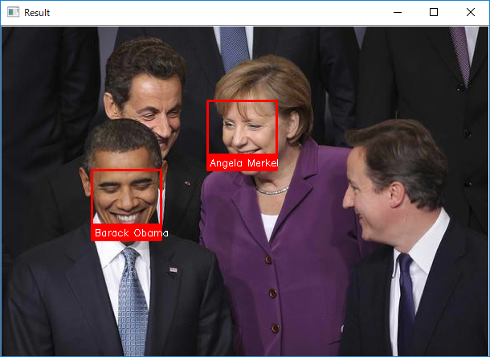
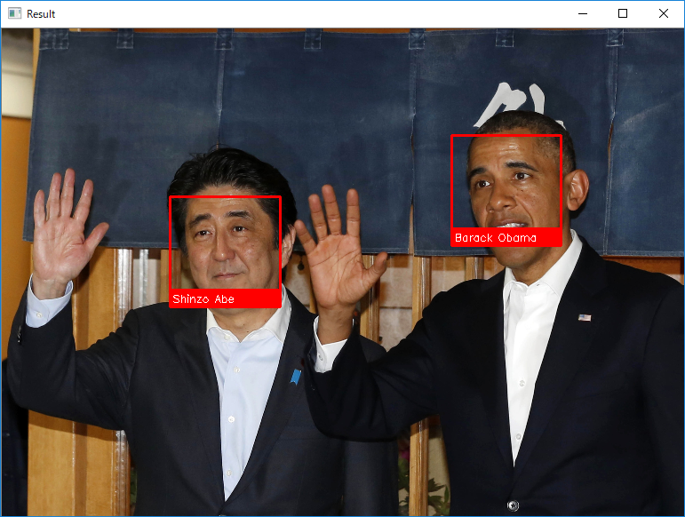
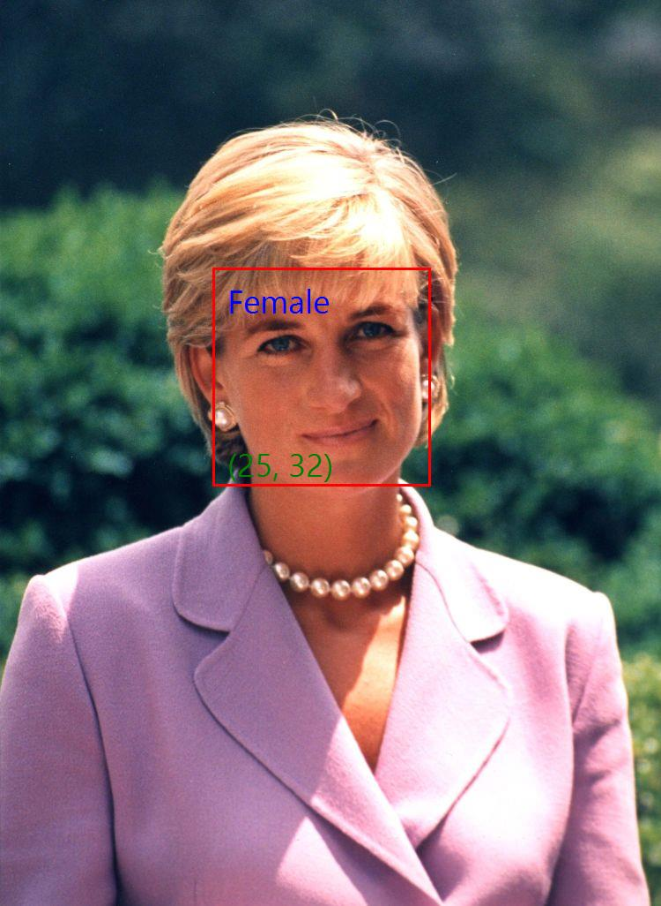
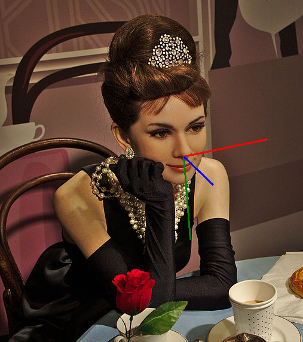
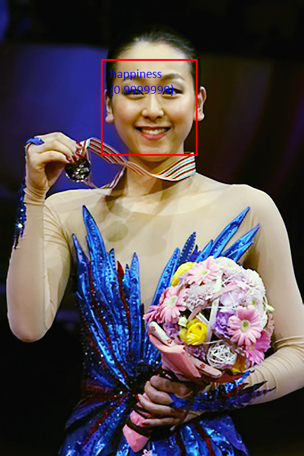

The world's simplest facial recognition api for .NET  
This repository is porting https://github.com/ageitgey/face_recognition by C#.

This package supports cross platform, Windows, Linux and MacOSX!!

|Package|OS|x86|x64|ARM|ARM64|Nuget|
|---|---|---|---|---|---|---|
|FaceRecognitionDotNet (CPU)|Windows|-|✓|-|-||
||Linux|-|✓|-|-||
||OSX|-|✓|-|-||
|FaceRecognitionDotNet for CUDA 9.2|Windows|-|✓|-|-||
||Linux|-|✓|-|-||
||OSX|-|-|-|-||
|FaceRecognitionDotNet for CUDA 10.0|Windows|-|✓|-|-||
||Linux|-|✓|-|-||
||OSX|-|-|-|-||
|FaceRecognitionDotNet for CUDA 10.1|Windows|-|✓|-|-||
||Linux|-|✓|-|-||
||OSX|-|-|-|-||
|FaceRecognitionDotNet for CUDA 10.2|Windows|-|✓|-|-||
||Linux|-|✓|-|-||
||OSX|-|-|-|-||
|FaceRecognitionDotNet for CUDA 11.0|Windows|-|✓|-|-||
||Linux|-|✓|-|-||
||OSX|-|-|-|-||
|FaceRecognitionDotNet for CUDA 11.1|Windows|-|✓|-|-||
||Linux|-|✓|-|-||
||OSX|-|-|-|-||
|FaceRecognitionDotNet for CUDA 11.2|Windows|-|✓|-|-||
||Linux|-|✓|-|-||
||OSX|-|-|-|-||
|FaceRecognitionDotNet for Intel MKL|Windows|-|✓|-|-||
||Linux|-|✓|-|-||
||OSX|-|✓|-|-||
|FaceRecognitionDotNet for ARM|Windows|-|-|-|-||
||Linux|-|-|-|-||
||OSX|-|-|-|-||

##### :warning: FaceRecognitionDotNet for ARM is not tested yet

## Support API

|face_recognition API|Corresponding API|Note|
|----|----|:----|
|batch_face_locations|BatchFaceLocations||
|compare_faces|CompareFaces||
|face_distance|FaceDistance||
|face_encodings|FaceEncodings||
|face_landmarks|FaceLandmarks|And support **Helen dataset** :warning:|
|face_locations|FaceLocations|And support to get confidence and use custom face detector|
|load_image_file|LoadImageFile||
|-|CropFaces|Crop image with specified locations|
|-|EyeBlinkDetect|Detect person is blinking or not Support Large model and **Helen dataset** :warning:|
|-|LoadImage|From memory data or System.Drawing.Bitmap|
|-|PredictAge|Predict human age. Use **Adience Benchmark Of Unfiltered Faces For Gender And Age Classification dataset** :warning:|
|-|PredictEmotion|Predict emotion for human face. Use **Corrective re-annotation of FER - CK+ - KDEF** :warning:|
|-|PredictGender|Predict human gender. Use **UTKFace dataset** :warning:|
|-|PredictProbabilityAge|Predict probability of human age. Use **Adience Benchmark Of Unfiltered Faces For Gender And Age Classification dataset** :warning:|
|-|PredictProbabilityEmotion|Predict probability of emotion from human face. Use **Corrective re-annotation of FER - CK+ - KDEF** :warning:|
|-|PredictProbabilityGender|Predict probability of human gender. Use **UTKFace dataset** :warning:|
|-|PredictHeadPose|Predict human head pose. Use **300W-LP dataset** :warning:|

##### :warning: Warning

You must train dataset by yourself.
I will **NOT** provide pretrained model file due to avoiding license issue.
You can check the following examples to train dataset.

* tools/AgeTraining
* tools/EmotionTraining
* tools/EmotionTrainingV2
* tools/GenderTraining
* tools/HeadPoseTraining
* tools/HelenTraining

## Demo

#### Face Recognition

 

#### Other Face Functions

|Face Landmark|Age and Gender Classification|Head Pose Estimation|Emotion Estimation|
|---|---|---|---|
|||||

## Document

FaceRecognitionDotNet support full xml document for Visual Studio.
A xml document is written English and Japanese.
And you can check online document at [FaceRecognitionDotNet API Document](https://taktak.jp/FaceRecognitionDotNet/)

## Dependencies Libraries and Products

#### [face_recognition](https://github.com/ageitgey/face_recognition/)

> **License:** The MIT License
>
> **Author:** Adam Geitgey
> 
> **Principal Use:** The world's simplest facial recognition api for Python and the command line. Main goal of FaceRecognitionDotNet is what ports face_recognition by C#.

#### [face_recognition_models](https://github.com/ageitgey/face_recognition_models/)

> **License:** Creative Commons Zero v1.0 Universal License
>
> **Author:** Adam Geitgey
> 
> **Principal Use:** Trained models for the face_recognition python library

#### [dlib](http://dlib.net/)

> **License:** Boost Software License
>
> **Author:** Davis E. King
> 
> **Principal Use:** A toolkit for making real world machine learning and data analysis applications in C++.

#### [DlibDotNet](https://github.com/takuya-takeuchi/DlibDotNet/)

> **License:** The MIT License
>
> **Author:** Takuya Takeuchi
> 
> **Principal Use:** Use dlib interface via .NET. This library is developed by this owner.

#### [OpenCVSharp](https://github.com/shimat/opencvsharp/)

> **License:** The BSD 3-Clause License
>
> **Author:** shimat
> 
> **Principal Use:** Loading image data by opencv wrapper for example