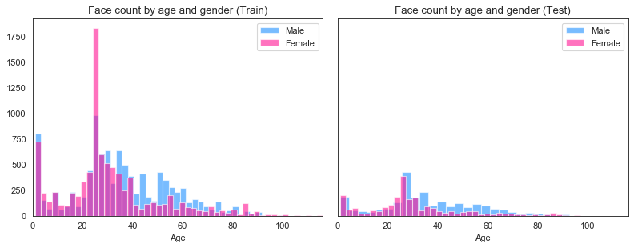
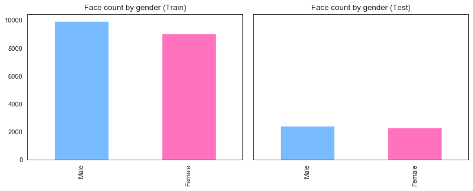
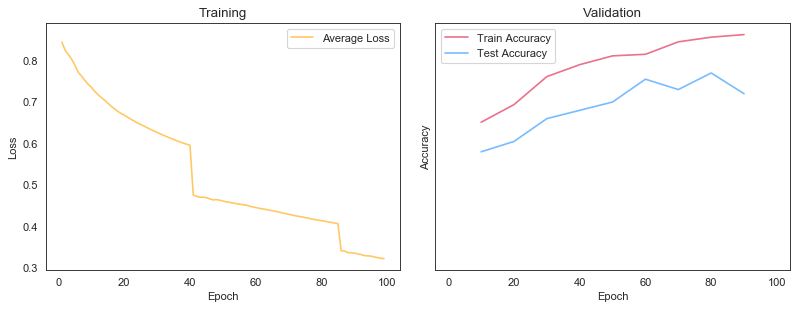

# Gender Training
 
This program aims to train human face images to classify gender.

## How to use?

## 1. Build

1. Open command prompt and change to &lt;GenderTraining_dir&gt;
1. Type the following command
````
dotnet build -c Release
````
2. Copy ***DlibDotNetNative.dll***, ***DlibDotNetNativeDnn.dll*** and ***DlibDotNetNativeDnnGenderClassification.dll*** to output directory; &lt;GenderTraining_dir&gt;\bin\Release\netcoreapp2.0.

**NOTE**  
- You should build ***DlibDotNetNative.dll***, ***DlibDotNetNativeDnn.dll*** and ***DlibDotNetNativeDnnGenderClassification.dll*** with CUDA.
- If you want to run at Linux and MacOS, you should build the **DlibDotNet** at first.  
Please refer the [Tutorial for Linux](https://github.com/takuya-takeuchi/DlibDotNet/wiki/Tutorial-for-Linux) or [Tutorial for MacOS](https://github.com/takuya-takeuchi/DlibDotNet/wiki/Tutorial-for-MacOS).

## 2. Download train and test data

Download data from the following url.

- https://drive.google.com/drive/folders/0BxYys69jI14kU0I1YUQyY1ZDRUE?usp=sharing
  - UTKFace.tar.gz

And extract them and copy to extracted files to &lt;GenderTraining_dir&gt;.

## 3. Create dataset

Create dataset from UTKFace directory by using ***tools/CreateDataset.ps1***.
The following command divides images to train and test randomly according to ***TrainRate***.
***TrainRate 8*** means that training data is 80% and test data is 20%.

````
pwsh tools\CreateDataset.ps1 -InputDirectory UTKFace -TrainRate 8 -OutputDirectory UTKFaceDataset -Max 0
````

## 4. Check dataset (Option)

You can check dataset status.

````
python tools\age-by-gender-hist.py UTKFaceDataset
````



````
python tools\gender-hist.py UTKFaceDataset
````



## 5. Run

````
cd <GenderTraining_dir>
dotnet run -c Release -- -d=UTKFaceDataset -b=400 -e=1500 -v=20
              Epoch: 1500
      Learning Rate: 0.001
  Min Learning Rate: 1E-05
     Min Batch Size: 400
Validation Interval: 20

Start load train images
Load train images: 18966
Start load test images
Load test images: 4738
step#: 0     learning rate: 0.001  average loss: 0            steps without apparent progress: 0
Epoch: 0, learning Rate: 0.001, average loss: 0.674069870253767
Epoch: 1, learning Rate: 0.001, average loss: 0.61758733607198
step#: 118   learning rate: 0.001  average loss: 0.59829      steps without apparent progress: 0
Epoch: 2, learning Rate: 0.001, average loss: 0.497301147655114
Epoch: 3, learning Rate: 0.001, average loss: 0.477524129911404
Epoch: 4, learning Rate: 0.001, average loss: 0.463913708851862
step#: 242   learning rate: 0.001  average loss: 0.463372     steps without apparent progress: 43
Epoch: 5, learning Rate: 0.001, average loss: 0.41626401307513
Epoch: 6, learning Rate: 0.001, average loss: 0.406071298713716
step#: 366   learning rate: 0.001  average loss: 0.400616     steps without apparent progress: 7
Epoch: 7, learning Rate: 0.001, average loss: 0.377037954321967
Epoch: 8, learning Rate: 0.001, average loss: 0.369290893870278
Epoch: 9, learning Rate: 0.001, average loss: 0.361628701590169
step#: 487   learning rate: 0.001  average loss: 0.361323     steps without apparent progress: 16
Epoch: 10, learning Rate: 0.001, average loss: 0.336463510539802
Saved state to utkface-gender-network_1500_0.001_1E-05_400
Epoch: 11, learning Rate: 0.001, average loss: 0.332591397454274
step#: 606   learning rate: 0.001  average loss: 0.329499     steps without apparent progress: 43
Epoch: 12, learning Rate: 0.001, average loss: 0.309775507864488
Epoch: 13, learning Rate: 0.001, average loss: 0.306856178331174
Epoch: 14, learning Rate: 0.001, average loss: 0.302869322321159
step#: 726   learning rate: 0.001  average loss: 0.301861     steps without apparent progress: 28
Epoch: 15, learning Rate: 0.001, average loss: 0.29106002112316
Epoch: 16, learning Rate: 0.001, average loss: 0.285738143057821
step#: 850   learning rate: 0.001  average loss: 0.283248     steps without apparent progress: 72
Epoch: 17, learning Rate: 0.001, average loss: 0.271353094977893
Epoch: 18, learning Rate: 0.001, average loss: 0.270071162790127
Epoch: 19, learning Rate: 0.001, average loss: 0.265453205132239
step#: 974   learning rate: 0.001  average loss: 0.26501      steps without apparent progress: 43
Epoch: 20, learning Rate: 0.001, average loss: 0.253938037542761
Epoch: 20, train accuracy: 0.884266582305178, test accuracy: 0.878429717180245
...
...
Saved state to utkface-gender-network
Epoch: 281   learning rate: 1e-05  average loss: 0.00222318   steps without apparent progress: 1444
Epoch: 282   learning rate: 1e-05  average loss: 0.00189907   steps without apparent progress: 1510
Saved state to utkface-gender-network_
Epoch: 283   learning rate: 1e-05  average loss: 0.00290589   steps without apparent progress: 1576
Saved state to utkface-gender-network
Epoch: 284   learning rate: 1e-05  average loss: 0.00326266   steps without apparent progress: 1642
Epoch: 285   learning rate: 1e-05  average loss: 0.00220292   steps without apparent progress: 1708
Saved state to utkface-gender-network_
Epoch: 286   learning rate: 1e-05  average loss: 0.00248163   steps without apparent progress: 1763
Epoch: 287   learning rate: 1e-05  average loss: 0.00245077   steps without apparent progress: 1829
Saved state to utkface-gender-network
Epoch: 288   learning rate: 1e-05  average loss: 0.00278778   steps without apparent progress: 1895
Saved state to utkface-gender-network_
Epoch: 289   learning rate: 1e-05  average loss: 0.00261527   steps without apparent progress: 1961
Epoch: 290   learning rate: 1e-06  average loss: 0.00226204   steps without apparent 
progress: 0
Saved state to utkface-gender-network
training num_right: 18948
training num_wrong: 18
training accuracy:  0.999050933248972
testing num_right: 4260
testing num_wrong: 478
testing accuracy:  0.899113550021106
````

## 6. Check training (Option)

You can check training log as graph.

````
python tools\visualize-log.py utkface-gender-network_100_0.001_1E-05_400.log
````

