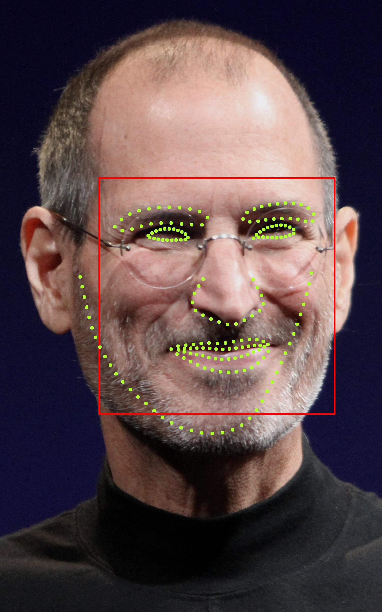

# Helen Training

This example train helen dataset.

## How to use?

## 1. Preparation

### model files

The model files are used for FaceRecognitonDotNet.

### Helen dataset

Dataset is provied at http://www.ifp.illinois.edu/~vuongle2/helen/
Download the following files to &lt;HelenTraining_dir&gt;. You need not to extract.

* http://www.ifp.illinois.edu/~vuongle2/helen/data/annotation.zip
* http://www.ifp.illinois.edu/~vuongle2/helen/data/helen_1.zip
* http://www.ifp.illinois.edu/~vuongle2/helen/data/helen_2.zip
* http://www.ifp.illinois.edu/~vuongle2/helen/data/helen_3.zip
* http://www.ifp.illinois.edu/~vuongle2/helen/data/helen_4.zip
* http://www.ifp.illinois.edu/~vuongle2/helen/data/helen_5.zip

## 2. Build

1. Open command prompt and change to &lt;HelenTraining_dir&gt;
1. Type the following command
````
dotnet build -c Release
````
2. Copy ***DlibDotNetNative.dll*** and ***DlibDotNetDnn.dll*** to output directory; &lt;HelenTraining_dir&gt;\bin\Release\netcoreapp2.0.
   * if you use FaceRecognitionDotNet with CUDA, you must copy also cuda libraries.

## 3. Run

1. Open command prompt and change to &lt;HelenTraining_dir&gt;
1. Type the following sample command

### Generate xml file

````
$ dotnet run -c Release -- generate -m "models" -p 50
````

#### Parameters

|Argument|Description|
|:---|:---|
|-m\|--model|Directory path includes model files|
|-p\|--padding|The padding of detected face area|

### Train

````
$ dotnet run -c Release -- train -x "helen\helen-dataset.xml" -t 8
````

### Parameters

|Argument|Description|
|:---|:---|
|-x\|--xml|The xml file was generated by **generate**|
|-t\|--thread|The number of thread|

### Demo

````
$ dotnet run -c Release -- demo -m "helen\helen-dataset.dat" -i "Steve_Jobs_Headshot_2010-CROP2.jpg" -d "models"
````



### Parameters

|Argument|Description|
|:---|:---|
|-m\|--model|The model file was generated by **train**|
|-i\|--image|The image file to test|
|-d\|--directory|Directory path includes model files|