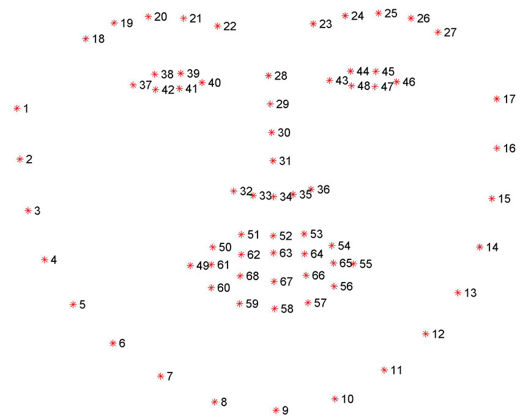
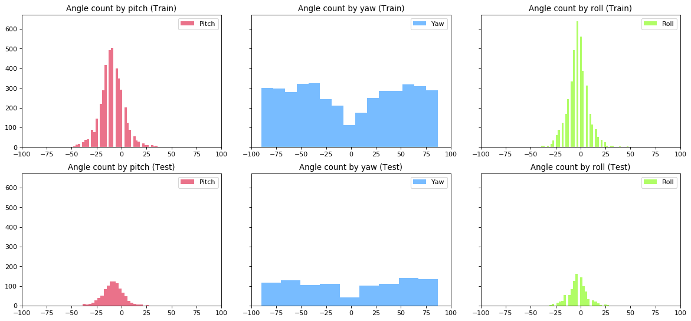

# Head Pose Training
 
This program aims to train human face images to estimate face pose.

## How to estimate?

At first, create input data from 68 face landmark. 
This time, **point 34** shall be center of face. 



And calculating **distance** from **point 34** to other points except for **point 34**. 
You must calculate in order of 68 face landmark from 1 to 68. 
After that, normalize vector by **z-score normalization** except for roll. 
Then, we got **67 vector**. 

However, there is 3 patterns of **distance** and these correspond to roll, pitch and yaw.

* Roll
  * distance is **arc tangent** for X and Y
* Pitch
  * distance is **euclidean distance** for only Y
* Yaw
  * distance is **euclidean distance** for only X

It means that we shall retrieve three **67 vector**.

And finally, train these vector by **kernel recursive least squares algorithm**.

## How to use?

## 1. Build

1. Open command prompt and change to &lt;HeadPoseTraining_dir&gt;
1. Type the following command
````
dotnet build -c Release
````
2. Copy ***DlibDotNetNative.dll*** and ***DlibDotNetNativeDnn.dll*** to output directory; &lt;HeadPoseTraining_dir&gt;\bin\Release\netcoreapp2.0.

## 2. Download train and test data

Download data from the following url.

- http://www.cbsr.ia.ac.cn/users/xiangyuzhu/projects/3DDFA/main.htm
  - 300W-LP

And extract them and copy extracted files to directory where you want to.

## 3. Create dataset

Create your dataset from 300W-LP directory by using ***tools/CreateDataset.ps1***.
The following command divides images to train and test randomly according to ***TrainRate***.
***TrainRate 8*** means that training data is 80% and test data is 20%.

````cmd
pwsh tools\CreateDataset.ps1 -InputDirectory <300W-LP-Dataset_dir> ^
                             -TrainRate 8 ^
                             -OutputDirectory <300W-LP-YourDataset_dir> ^
                             -Max 0
````

## 4. Check dataset (Option)

You can check dataset status.

````cmd
python tools\pose-hist.png.py <300W-LP-YourDataset_dir>
````


For examples, this is other custom dataset which sample size is limited to 5000 samples.



## 5. Train

````cmd
cd <HeadPoseTraining_dir>
dotnet run -c Release -- train --dataset <300W-LP-YourDataset_dir> ^
                      --gamma 0.1 ^
                      --tolerance 0.001 ^
                      --range 10 ^
                      --output <300W-LP-YourDataset_dir>\result

  Dataset: <300W-LP-YourDataset_dir>
Tolerance: 0.001
    Gamma: 0.1
    Range: 10
     Pose: All
   Output: <300W-LP-YourDataset_dir>\result

Start load train images
Use Cache <300W-LP-YourDataset_dir>\train\cache_Roll.dat
Load train images: 4000
Start load test images
Use Cache <300W-LP-YourDataset_dir>\test\cache_Roll.dat
Load test images: 1000

Training
100.00% Step 4000 of 4000                                  00:06:55
───────────────────────────────────────────────────────────────────
Validation for Training data
100.00% Step 4000 of 4000                                  00:00:01
───────────────────────────────────────────────────────────────────
training num_right: 4000
training num_wrong: 0
 training accuracy:  1.0000

Validation for Test data
100.00% Step 1000 of 1000                                  00:00:00
───────────────────────────────────────────────────────────────────
testing num_right: 872
testing num_wrong: 128
 testing accuracy:  0.8720
train accuracy: 1.0000, test accuracy: 0.8720

Start load train images
Use Cache <300W-LP-YourDataset_dir>\train\cache_Pitch.dat
Load train images: 4000
Start load test images
Use Cache <300W-LP-YourDataset_dir>\test\cache_Pitch.dat
Load test images: 1000

Training
100.00% Step 4000 of 4000                                  00:00:16
───────────────────────────────────────────────────────────────────
100.00% Step 4000 of 4000                                  00:00:00
───────────────────────────────────────────────────────────────────
training num_right: 3949
training num_wrong: 51
 training accuracy:  0.9873
100.00% Step 1000 of 1000                                  00:00:00
───────────────────────────────────────────────────────────────────
testing num_right: 969
testing num_wrong: 31
 testing accuracy:  0.9690
train accuracy: 0.9873, test accuracy: 0.9690

Start load train images
Use Cache <300W-LP-YourDataset_dir>\train\cache_Yaw.dat
Load train images: 4000
Start load test images
Use Cache <300W-LP-YourDataset_dir>\test\cache_Yaw.dat
Load test images: 1000
100.00% Step 4000 of 4000                                  00:00:27
───────────────────────────────────────────────────────────────────
100.00% Step 4000 of 4000                                  00:00:00
───────────────────────────────────────────────────────────────────
training num_right: 4000
training num_wrong: 0
 training accuracy:  1.0000
100.00% Step 1000 of 1000                                  00:00:00
───────────────────────────────────────────────────────────────────
testing num_right: 1000
testing num_wrong: 0
 testing accuracy:  1.0000
train accuracy: 1.0000, test accuracy: 1.0000
````

## 6. Visualize Evaluation (Option)

You can evaluate dataset by visualize image.

````cmd
cd <HeadPoseTraining_dir>
dotnet run -c Release -- eval --image <300W-LP>\AFW\AFW_134212_1_4.jpg ^
                              --mat <300W-LP>\AFW\AFW_134212_1_4.mat ^
                              --landmark <300W-LP>\landmarks\IBUG\IBUG_image_003_1_5_pts.mat ^
                              --roll <300W-LP-YourDataset_dir>\result\300w-lp-roll-krls_0.001_0.1.dat ^
                              --pitch <300W-LP-YourDataset_dir>\result\300w-lp-pitch-krls_0.001_0.1.dat ^
                              --yaw <300W-LP-YourDataset_dir>\result\300w-lp-yaw-krls_0.001_0.1.dat ^
                              --output <300W-LP-YourDataset_dir>\result\eval

      Image File: <300W-LP>\AFW\AFW_134212_1_4.jpg
        Mat File: <300W-LP>\AFW\AFW_134212_1_4.mat
   Landmark File: <300W-LP>\landmarks\AFW\AFW_134212_1_4_pts.mat
       Roll File: <300W-LP-YourDataset_dir>\result\300w-lp-roll-krls_0.001_0.1.dat
      Pitch File: <300W-LP-YourDataset_dir>\result\300w-lp-pitch-krls_0.001_0.1.dat
        Yaw File: <300W-LP-YourDataset_dir>\result\300w-lp-yaw-krls_0.001_0.1.dat
Output Directory: <300W-LP-YourDataset_dir>\result\eval

       Roll: -12.5080101676021
      Pitch: -24.7073657941586
        Yaw: 46.8672622731993
 Predicted Roll: -6.62495690307041
Predicted Pitch: -23.208335859383
  Predicted Yaw: 46.6662299870219
````

#### Ground Truth


#### Prediction


## 7. Evaluation

The following table is evaluation from author's data. 
The condition is here. 

* Training Data: 4000
* Test Data: 1000
* Tolerance: 0.001
* Gamma: 0.1

|Pose|±10 degree|±5 degree|±3 degree|
|---|---|---|---|
|Roll|0.9660|0.9030|0.8020|
|Pitch|0.9720|0.8470 |0.7000|
|Yaw|1.000|1.000|0.9970|